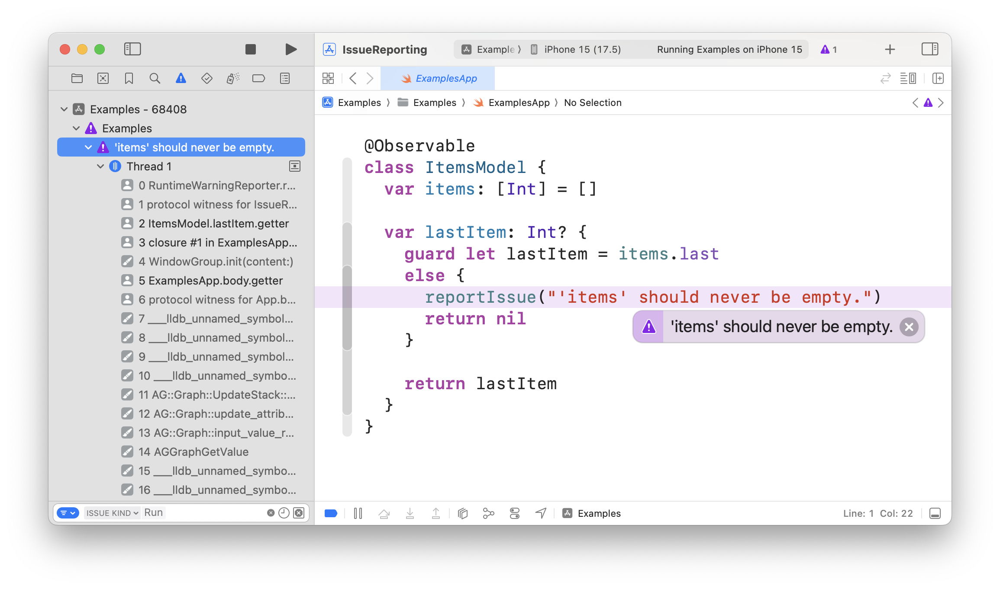

# Swift Issue Reporting

[](https://github.com/pointfreeco/xctest-dynamic-overlay/actions/workflows/ci.yml)
[](https://swiftpackageindex.com/pointfreeco/xctest-dynamic-overlay)
[](https://swiftpackageindex.com/pointfreeco/xctest-dynamic-overlay)

Report issues in your application and library code as Xcode runtime warnings, breakpoints, 
assertions, and do so in a testable manner.

## Overview

This library provides robust tools for reporting issues in your application with a customizable
degree of granularity and severity. In its most basic form you use the `reportIssue` function
anywhere in your application to flag an issue in your code, such as a code path that you think
should never be executed:

```swift
guard let lastItem = items.last
else {
  reportIssue("'items' should never be empty.")
  return 
}
…
```

By default, this will trigger an unobtrusive, purple runtime warning when running your app in Xcode
(simulator and device):

<picture>
  <source media="(prefers-color-scheme: dark)" srcset="Sources/IssueReporting/Documentation.docc/Resources/runtime-warning~dark.png">
  <source media="(prefers-color-scheme: light)" srcset="Sources/IssueReporting/Documentation.docc/Resources/runtime-warning.png">
  
</picture>

This provides a very visual way of seeing when an issue has occurred in your application without
stopping the app's execution or interrupting your workflow.

The `reportIssue` tool can also be customized to allow for other ways of reporting issues. It can be
configured to trigger a breakpoint if you want to do some debugging when an issue is reported, or a
precondition or fatal error if you want to truly stop execution. And you can create your own custom
issue reporter to send issues to OSLog or an external server. 

Further, when running your code in a testing context (both Swift's native Testing framework as well
as XCTest), all reported issues become _test failures_. This helps you get test coverage that
problematic code paths are not executed, and makes it possible to build testing tools for libraries
that ship in the same target as the library itself.

<picture>
  <source media="(prefers-color-scheme: dark)" srcset="Sources/IssueReporting/Documentation.docc/Resources/test-failure~dark.png">
  <source media="(prefers-color-scheme: light)" srcset="Sources/IssueReporting/Documentation.docc/Resources/test-failure.png">
  
</picture>

Issue Reporting comes with a number of reporters, custom reporting functionality, and more. To learn
about these features, see
[Getting started](Sources/IssueReporting/Documentation.docc/Articles/GettingStarted.md).

## Case studies

There are many popular libraries out there using Issue Reporting. To name a few:

  * [**Perception**](https://github.com/pointfreeco/swift-perception) is a back-port of Swift's
    Observation framework that can be deployed all the way back to the iOS 13 generation of devices,
    but requires a special SwiftUI view to observe changes to objects annotated with the macro. When
    the library detects this view is missing, it uses Issue Reporting to warn developers with a
    trace pointing to the view.

  * [**Dependencies**](https://github.com/pointfreeco/swift-dependencies) is a general purpose
    dependency injection library inspired by SwiftUI's environment. It uses Swift Issue Reporting to
    notify users when they access dependencies without overridding them. This results in runtime
    warnings when running in the simulator, and test failures when testing. It forces each test
    to explicitly declare its dependencies, and when a new dependency is introduced to a feature,
    existing tests will fail until they account for it.

<!--  * [**Swift Navigation**](https://github.com/pointfreeco/swiftui-navigation) provides concise-->
<!--    domain modeling tools for UI frameworks including SwiftUI, UIKit, and more; and it uses Swift-->
<!--    Issue Reporting to raise runtime warnings when APIs are used in unexpected ways.-->

  * [**The Composable Architecture**](https://github.com/pointfreeco/swift-composable-architecture)
    comes with powerful testing tools that support both Swift Testing and XCTest out of the box
    thanks to Swift Issue Reporting. In addition, the library is heavily instrumented with issue
    reporting to help developers catch bugs in their code early.

  * [**Custom Dump**](https://github.com/pointfreeco/swift-custom-dump) is an improved version of
    Swift's `dump` function, and a whole lot more. It provides well-formatted dumps of data types
    that read like Swift code, as well as well-formatted diffs when data types are compared. It also
    ships several test helpers powered by Swift Issue Reporting, including drop-in replacements for
    `#expect(_ == _)` and `XCTAssertEqual` that render failures as concise diffs, as well as helpers
    that allow you to assert against changes to data structures over time.

  * [**Swift Clocks**](https://github.com/pointfreeco/swift-clocks) and
    [**Combine Schedulers**](https://github.com/pointfreeco/combine-schedulers) are sibling packages
    that use issue reporting to drive their "test" and "unimplemented" clocks and schedulers. "Test" 
    clocks/schedulers allow you to _control time_ in tests, and will emit failures when expectations
    aren't met. "Unimplemented" clocks/schedulers record unexpected usage as issues.

Have another case study to share? [Let us know!](edit/main/README.md)

## Documentation 

Full documentation can be found
[here](https://swiftpackageindex.com/pointfreeco/swift-issue-reporting/main/documentation).

## License

This library is released under the MIT license. See [LICENSE](LICENSE) for details.
